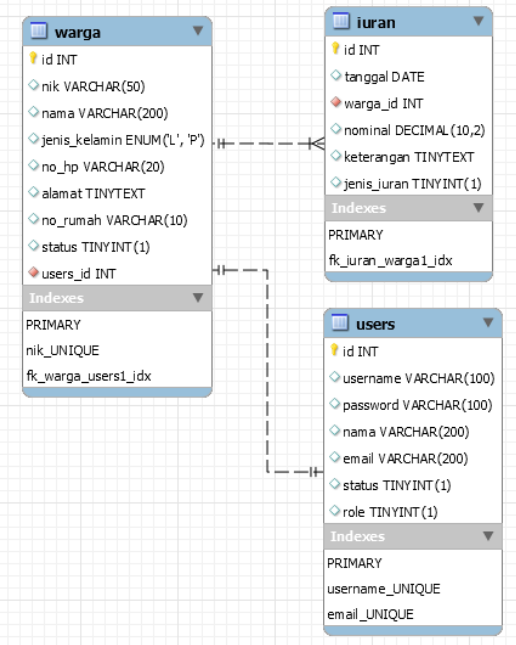

# :rocket: Membuat Website CRUD dengan PHP MYSQL

Made With :    

- Nama : Hizbullah Ridwan
- NIM : 312110055
- Kelas : TI.21.B.1
- Mata Kuliah : Pemrograman Web

Daftar isi :

- [Introduction](https://github.com/Ridwanwildan/Lab8Web#run-mysql-server)
- [Database Tables](https://github.com/Ridwanwildan/Lab8Web#go-to-phpmyadmin)
- [Capture Features](https://github.com/Ridwanwildan/Lab8Web#initialization-in-root-directory)
- [Demo Website](https://github.com/Ridwanwildan/Lab8Web#build-crud)

## Introduction

Website CRUD ini menggunakan bahasa pemrograman PHP dan databasenya menggunakan MYSQL dengan case yaitu Data Iuran Warga. Yang akan ditampilkan adalah data warga, laporan iuran setiap warga, data warga yang belum membayar iuran, dan juga laporan jumlah uang iuran.
Fitur-fitur yang ada diwebsite ini adalah :

- Tambah data warga
- Menampilkan data warga
- Ubah data warga
- Hapus data warga
- Tambah Transaksi Iuran
- Menampilkan data warga yang belum iuran berdasarkan bulan dan jenis iuran
- Menampilkan data iuran yang sudah dibayar berdasarkan nama warga
- Laporan jumlah uang iuran

Ada beberapa fitur yang belum tersedia diwebsite ini, salah satunya adalah fitur login untuk role admin dan role user. Jadi jika website ini diakses, pengunjung yang mengakses dianggap sebagai admin. Dan website ini belum menerapkan tampilan mobile first, sebaiknya akses menggunakan perangkat komputer atau laptop supaya tampilan website lebih terlihat jelas.

## Database Tables

Website ini menggunakan 3 tabel database MYSQL untuk menyimpan data.

### users table

Tabel users untuk menyimpan data user yang sudah login. Tetapi fitur login saat ini belum tersedia. Status = 1 artinya user tersebut adalah admin dan Status = 2 artinya user tersebut merupakan user biasa.

### warga table

Tabel warga untuk menyimpan data warga dimana Status = 1 artinya warga tersebut adalah warga aktif dan Status = 2 artinya warga tersebut Nonaktif. Di website ini semua warga yang datanya ditampilkan dianggap sebagai warga aktif.

### iuran table

Tabel iuran untuk menyimpan data iuran dari setiap warga. ada 3 kategori jenis_iuran, jenis_iuran = 1 artinya iuran Uang Kas. jenis_iuran = 2 artinya iuran Uang Sampah dan jenis_iuran = 3 artinya iuran Sumbangan.

## Capture Features

### Main Page

Tampilan utama dari website ini adalah data warga yang berisi NIK, Nama, Jenis Kelamin, Nomor HP, Alamat dan Nomor Rumah. Ada button titik 3 dipaling kanan. button tersebut merupakan dropdown yang isinya adalah button untuk ubah data, hapus data, lihat transaksi iuran warga tersebut, dan tambah transaksi iuran.

### Add Data Warga

Tampilan untuk melakukan create data pada tabel warga berisi input elemen dan juga radio button. Hal yang harus diinput adalah NIK, Nama, Jenis Kelamin, Nomor HP, Alamat dan Nomor Rumah. Dan yang terakhir adalah button 'Simpan' untuk menyimpan data kedalam database. users_id yang diinput disini yaitu users_id = 1

### Change Data Warga

Tampilan untuk melakukan update data pada tabel warga berisi input elemen dan juga radio button. Sama seperti create data, Hal yang bisa diubah adalah NIK, Nama, Jenis Kelamin, Nomor HP, Alamat dan Nomor Rumah. Dan yang terakhir adalah button 'Simpan' untuk menyimpan data kedalam database.

### Delete Data Warga

Delete tidak memiliki page sendiri, melainkan hanya memunculkan popup/modal yang berisi pertanyaan akan menghapus data atau tidak.

### Show Data Iuran

Tampilan read tabel iuran adalah tabel yang menampilkan Nama, Jenis Iuran, Nominal, Tanggal Pembayaran, dan Keterangan berdasarkan nama warganya.

### Add Data Iuran

Tampilan add iuran adalah berupa elemen input dan radio button. Hal yang harus ditambahkan adalah jenis iuran, Nominal, Tanggal Pembayaran dan Keterangannya.

### Show Unpaid Data

Page ini menampilkan list dari warga yang belum bayar berdasarkan bulan dan jenis iurannya. Contoh diatas adalah list dari warga yang belum membayar iuran Uang kas di bulan Desember 2022.

### Show Total of Iuran

Tampilan dari page ini adalah berupa jumlah keseluruhan uang yang terdata selama setahun. Dipisahkan berdasarkan jenis iuran dan bulannya. Serta terdapat elemen option untuk memilih tahunnya. Pada contoh diatas, tidak ada list untuk bulan Juni, Juli, Agustus, dan September 2022 karena tidak ada data yang di record di bulan tersebut.

## Demo Website

Demo website menggunakan subdomain dan hosting gratis dari infinityfree.com. Infinityfree bisa melakukan penonaktifan kapan saja pada website ini. Fitur yang ada diwebsite bisa dicoba dengan mengakses link berikut :

http://hizbullahridwan.infinityfreeapp.com/

